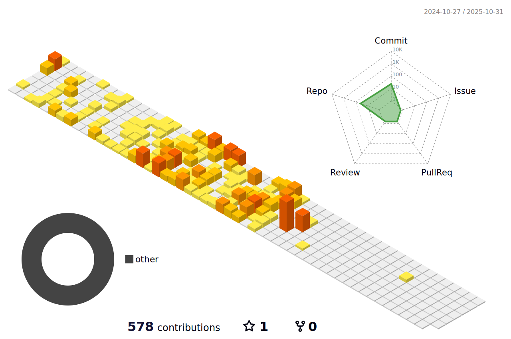

<!-- ## Hi 👋 -->

  

  <a href="https://github.com/ArnoldW-dev"></a>
  

Senior Full-stack Engineer with 13+ years of experience delivering secure, scalable web applications across startups, dev agencies, and global tech environments like **Spotify**. Hands-on expert in **C#/.NET Core, Java/Spring Boot**, and modern JavaScript frameworks (**React, Angular**), with deep experience in building microservices and deploying cloud-native solutions in **Azure** and **AWS**.

Skilled in driving end-to-end delivery — from system architecture to CI/CD pipelines — and translating complex tech into business value. Known for leading cross-functional teams, mentoring junior devs, and championing clean, high-performance code in fast-paced Agile environments.

<!-- Languages & Core Frameworks -->

  
  
  
  
  
  
  
  
  
  
  

<!-- Backend / Framework Ecosystem -->

  
  
  
  
  
  
  
  
  

<!-- Front-End & UI / UX -->

  
  
  
  
  
  
  

<!-- Databases & Messaging -->

  
  
  
  
  
  
  

<!-- Cloud & DevOps -->

  
  
  
  
  
  
  

<!-- Testing & QA -->

  
  
  
  
  
  
  
  
  
  

<!-- Collaboration & Tools -->

  
  
  
  
  
  
  
  
  

<!-- prettier-ignore-start -->

<!--    -->
  

  

  

<h3 align="center">Highlighted projects</h3>

  
  

  Reach me at <a href="mailto:arnoldwesley.dev@gmail.com">arnoldwesley.dev@gmail.com</a> ·
  <a href="https://linkedin.com/in/YOUR_PROFILE">LinkedIn</a>

<!-- prettier-ignore-end -->

<!--
**iraldiri/iraldiri** is a ✨ _special_ ✨ repository because its `README.md` (this file) appears on your GitHub profile.

Here are some ideas to get you started:

- 🔭 I’m currently working on ...
- 🌱 I’m currently learning ...
- 👯 I’m looking to collaborate on ...
- 🤔 I’m looking for help with ...
- 💬 Ask me about ...
- 📫 How to reach me: ...
- 😄 Pronouns: ...
- ⚡ Fun fact: ...
-->
